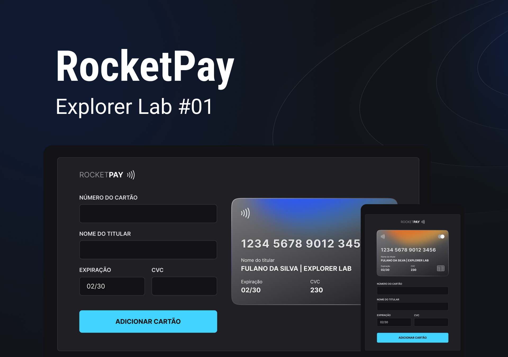

<div align="center">
  
</div><br>

# ExplorerLab | JS & DOM
Primeira edição do ExplorerLab, um evento com foco total em front-end, utilizando as ferramentas mais atuais para o desenvolvimento de um projeto com usabilidade real.<br>
Nesta edição, será construido um componente que simula o formulário de preenchimento de um sistema de cartão de crédito, onde é possível adicionar máscaras aos inputs e atualizar o HTML através da manipulação dos elementos com o uso do Javascript DOM.
<br>

<p align="center">
  <a href="#-aprendizados">Aprendizados</a>&nbsp;&nbsp;&nbsp;|&nbsp;&nbsp;&nbsp;
  <a href="#-tecnologias">Tecnologias</a>&nbsp;&nbsp;&nbsp;|&nbsp;&nbsp;&nbsp;
  <a href="#-layout">Layout</a>&nbsp;&nbsp;&nbsp;|&nbsp;&nbsp;&nbsp;
  <a href="#-intalação">Instalação</a>&nbsp;&nbsp;&nbsp;|&nbsp;&nbsp;&nbsp;
  <a href="#memo-licença">Licença</a>
</p>

<p align="center">
  
</p><br>

<p align="center">
  
</p>

## 🏆 Aprendizados
  ### GIT CLI:
  É uma ferramenta para uso do GitHub através das linhas de comando do terminal. Com o git cli é possível:
    - Visualizar, criar e clonar repositórios
    - Criar, fechar, editar e visualizasr problemas e pull requests
    - Rever, fazer diff e merge de pull request
    - Executar, visualizar e listar fluxos de trabalho
    - Criar, listar, visualizar e excluir versões
    - Entre outros!

  ### Vite
  Utilização do VITE em um projeto vanilla JS. O vite utiliza o ES6 module para realizar os seus imports e exports

  ### JS | DOM
  Disponibilizar a função para ser acessada em um contexto global
    - globalThis.setCardType

## 🚀 Melhorias e Desafios feitos para ir além
- Adicionado uma terceira bandeira de cartão (`American Express` e `Elo`).
  - Modelo criado no Figma e também incorporado ao código
- Divisão de responsabilidade sobre cada função.

## 🚀 Tecnologias

Esse projeto foi desenvolvido com as seguintes tecnologias:

- HTML e CSS
- JavaScript e JSON
- [GIT](https://git-scm.com/)
- [GIT cli](https://cli.github.com/)
- [Node e NPM](https://nodejs.org/)
- [Vite](https://vitejs.dev/)
- [iMask](https://imask.js.org)


## 🎨 Layout

  - [Layout do projeto](https://www.figma.com/file/I2lc4S7kAm2VFfe1avXMxn/Explorer-Lab-%2301-(Copy)?node-id=3%3A1165)

## 💿 Instalação

```bash
# Faça o clone do repotório
  git@github.com:RenanFachin/RS_ExplorerLab_RocketPAY.git

# Acessar a pasta do projeto pelo terminal
  cd RS_ExplorerLab_RocketPAY

# Faça a instalação das depêndencias
  npm i

# Rodando o projeto
  npm run dev

## 📝 Licença

Esse projeto está sob a licença MIT.

---

Feito com ♥ by Rocketseat 👋 [Participe da nossa comunidade!](https://discord.gg/rocketseat)
